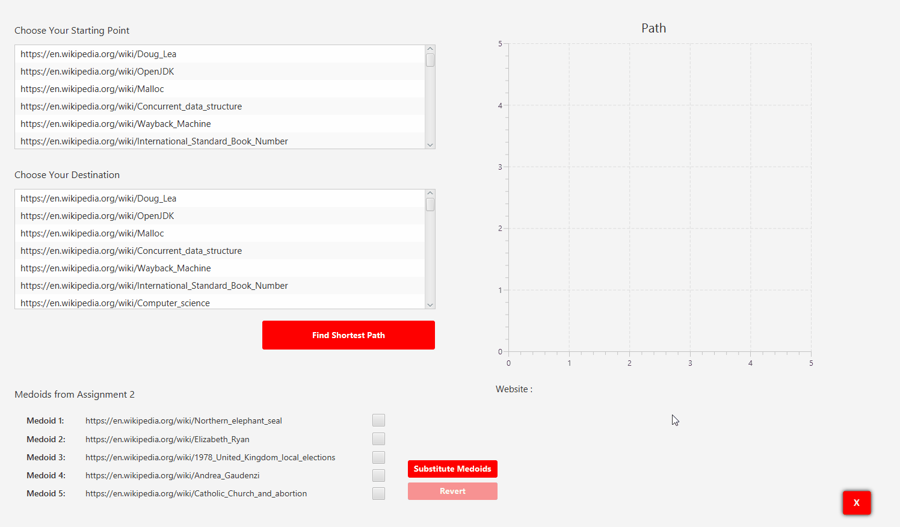

# Custom-Wiki-Graph 

This project has two parts, a loader and an application. The loader reads one Wiki page from a file and web crawls to over 500 other Wiki pages, scraping words and counting their frequencies, storing them in a graph. The graph's edges are weighted by computing the cosine between the two nodes the edge connects. The graph is stored in a serialized file to be read by the application. The application allows a user to pick any two stored websites and find the shortest path between them, if one exists.

Wikipedia's page on Dijkstra was very helpful : https://en.wikipedia.org/wiki/Dijkstra's_algorithm
